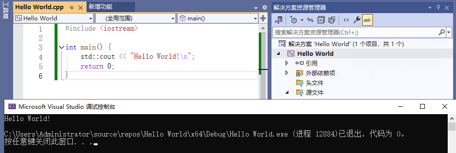

第一台计算机于二战期间被制造，用于遥测。
过程化、结构化和面向对象编程
直到最近，人们还认为程序是一系列作用于数据的过程。过程或函数是一组逐个执行的特定指令。数据与过程完全分开，编程的诀窍是跟踪哪些函数调用了哪些其他函数以及哪些数据被更改。为了理解这种可能令人困惑的情况，人们创建了结构化编程。
结构化编程背后的主要思想与分而治之的思想一样简单。计算机程序可以被认为是由一组任务组成的。任何过于复杂而无法简单描述的任务都会被分解为一组较小的组件任务，直到这些任务足够小且足够独立，以至于它们很容易被理解。

按ctrl+f5直接编译运行
```cpp
#include <iostream>

int main() {
	std::cout << "Hello World!\n";
	return 0;
}
```

g++ -o hello Hello.cpp

1.6.1 测验 
1．解释器和编译器有何不同？ 
解释器是一种对代码（或字节码）进行解释并执行相应操作的工具；
编译器将代码作为输入， 并生成目标文件。就 C++而言，编译和链接后，将得到一个可执行文件，处理器可直接执行它，而无 需做进一步解释。
2．链接器的作用是什么？ 
编译器将 C++代码文件作为输入，并生成一个使用机器语言的目标文件。通常，您的代码依赖 于库和其他代码文件中的函数。
链接器负责建立这些链接，并生成一个可执行文件，它集成了您指定 的所有直接或间接依存关系。
3．正常的开发周期包括哪些步骤？
编写代码；
通过编译创建目标文件；
通过链接创建可执行文件；
执行应用程序以便进行测试； 
调试；修复代码中的错误并重复这些步骤。

