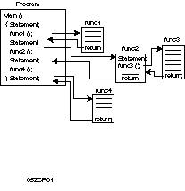
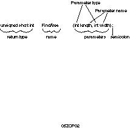
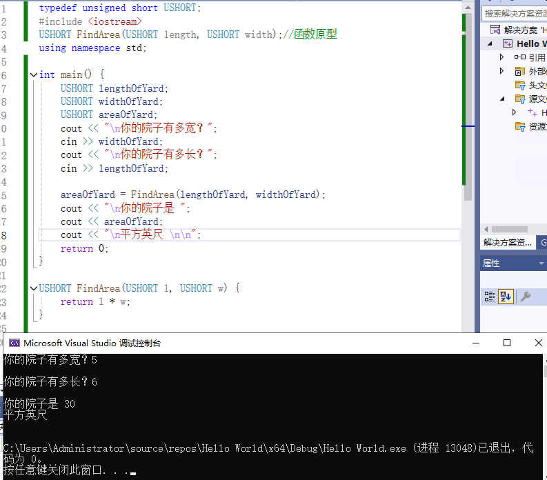
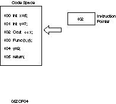
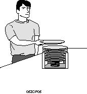
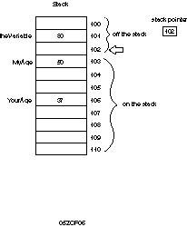
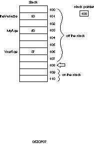

###### 目标
```cpp
尽管面向对象编程已将注意力从函数转移到对象，但函数仍然是任何程序的核心组件。
- 什么是函数以及它的组成部分是什么。
    
- 如何声明和定义函数。
    
- 如何将参数传递到函数。
    
- 如何从函数返回值。
```
###### 什么是函数？
```cpp
函数实际上是一个可以对数据进行操作并返回值的子程序。
每个 C++ 程序至少有一个函数main()。程序启动时，会自动调用main() 。main ()可能会调用其他函数，其中一些函数可能会调用其他函数。
```

每个函数都有自己的名称，当遇到该名称时，程序的执行将分支到该函数的主体。当函数返回时，执行将从调用函数的下一行恢复。


###### 如何声明和定义函数。
```cpp
在程序中使用函数需要先声明该函数，然后定义该函数。
声明告诉编译器该函数的名称、返回类型和参数。定义告诉编译器该函数的工作原理。
任何函数都不能从任何其他未先声明的函数调用。函数的声明称为其原型。
```

###### 声明函数
```cpp
将原型写入文件，然后使用#include指令将其包含在程序中。

将原型写入使用函数的文件中。

在任何其他函数调用该函数之前定义该函数。当您这样做时，定义将充当其自身的声明。
```

###### 函数原型
```cpp
函数原型是一个语句，也就是说它以分号结尾。
它由函数的返回类型、名称和参数列表组成。
```

*==请注意，函数原型不需要包含参数的名称，只需包含其类型。如下所示的原型是完全合法的==*

```cpp
long Area(int, int);
```
*虽然这是合法的，但这并不是一个好主意。添加参数名称可使原型更清晰。具有命名参数的相同函数可能为*
```cpp
long Area(int length, int width);
```
***声明和定义函数***
```cpp
typedef unsigned short USHORT;
#include <iostream>
USHORT FindArea(USHORT length, USHORT width);//函数原型
using namespace std;

int main() {
	USHORT lengthOfYard;
	USHORT widthOfYard;
	USHORT areaOfYard;
	cout << "\n你的院子有多宽？";
	cin >> widthOfYard;
	cout << "\n你的院子有多长？";
	cin >> lengthOfYard;

	areaOfYard = FindArea(lengthOfYard, widthOfYard);
	cout << "\n你的院子是 ";
	cout << areaOfYard;
	cout << "\n平方英尺 \n\n";
	return 0;
}

USHORT FindArea(USHORT l, USHORT w) {
	return l * w;
}
```



###### 定义函数
```cpp
函数定义由函数头和函数体组成。
函数头与函数原型完全相同，只是参数必须命名，并且没有终止分号。
函数体是一组括在括号中的语句

```


###### 变量的作用域
```cpp
4:     #include <iostream.h>
5:
6:     int Doubler(int AmountToDouble);
7:
8:     int main()
9:     {
10:
11:         int result = 0;
12:         int input;
13:
14:         cout << "Enter a number between 0 and 10,000 to double: ";
15:         cin >> input;
16:
17:         cout << "\nBefore doubler is called... ";
18:         cout << "\ninput: " << input << " doubled: " << result << "\n";
19:
20:         result = Doubler(input);
21:
22:         cout << "\nBack from Doubler...\n";
23:         cout << "\ninput: " << input << "   doubled: " << result << "\n";
24:
25:
26:         return 0;
27:    }
28:
29:    int Doubler(int original)
30:    {
31:         if (original <= 10000)
32:              return original * 2;
33:         else
34:              return -1;
35:         cout << "You can't get here!\n";
36: }
```

Enter a number between 0 and 10,000 to double:
9000 
Before doubler is called... 
input 9000 doubled;0
Back from doubler...
input: 9000   doubled: 18000

内联函数

为啥使用inline ，如果你有一个小函数只有2个语句，就可以使用inline减少开销
如果使用关键字inline声明函数，则编译器不会创建真正的函数：它会将内联函数中的代码直接复制到调用函数中。不会发生任何跳转；就像您将函数的语句直接写入调用函数一样。

```cpp
1：// 清单 5.9 - 演示内联函数
2：
3：#include <iostream.h> 
4：
5：inline int Double(int); 
6：
7：int main() 
8：{ 
9：int target; 
10：
11：cout << "输入一个要处理的数字："; 
12：cin >> target; 
13：cout << "\n"; 
14：
15：target = Double(target); 
16：cout << "目标：" << target << endl; 
17：
18：target = Double(target); 
19：cout << "目标：" << target << endl; 
20：
21：
22：target = Double(target); 
23：cout << "目标：" << target << endl; 
24：return 0; 
25: } 
26: 
27: int Double(int target) 
28: { 
29: return 2*target; 30: }输出：输入一个要处理的数字：20目标：40目标：80目标：160


分析： 在第 5 行， Double() 被声明为一个内联函数，它接受一个int参数并返回一个int 值。该声明与其他任何原型一样，只是在返回值之前添加了 关键字inline 。
```

##### 递归

###### 直接递归&&间接递归
函数可以调用自身。这称为递归，递归可以是直接的，也可以是间接的。当函数调用自身时，就是直接递归；当一个函数调用另一个函数，然后另一个函数又调用第一个函数时，就是间接递归。

```cpp
//使用递归查找第n个斐波那契数
//使用Fib(n) = fib(n-1) + fib(n-2)
// 停止条件：n = 2 || n = 1 

#include<iostream>
using namespace std;
int fib(int n);
int main() {
	int n, answer;
	cout << "输入要查找的数字：\n";
	cin >> n;
	answer = fib(n);
	cout << answer << "是第" << n << "个斐波那契数\n";
	return 0;

}

int fib(int n) {
	if (n < 3) {
		cout << "返回1\n";
		return(1);
	}
	else {
		return (fib(n - 1) + fib(n - 2));
	}
}
```

**注意：** 递归是高级编程中非常棘手的部分。这里介绍它是因为了解它的工作原理非常有用，但如果您不完全了解所有细节，也不必太担心


### 函数工作原理一探究竟

调用函数时，代码会转到被调用函数，传入参数，并执行函数主体。函数完成后，将返回一个值（除非函数返回void），并将控制权返回给调用函数。

这个任务是如何完成的？代码如何知道要分支到哪里？传入变量时它们保存在哪里？函数主体中声明的变量会发生什么？返回值如何传回？代码如何知道从哪里恢复？

大多数入门书籍都不会尝试回答这些问题，但如果不理解这些信息，你会发现编程仍然是一个模糊的谜。解释需要简要讨论一下计算机内存。

***==学编程一定要了解代码和内存的关系以及代码是如何抽象出来的==***
#### 抽象层次

对于新程序员来说，主要障碍之一是要应对多层智力抽象。当然，计算机只是电子机器。它们不知道窗口和菜单，不知道程序或指令，甚至不知道 1 和 0。实际上，只是在集成电路的各个位置测量电压。即使这也是一个抽象：电本身只是一个智力概念，代表亚原子粒子的行为。

很少有程序员会费心考虑 RAM 值概念以下的任何细节。毕竟，您无需了解粒子物理学即可驾驶汽车、烤面包或打棒球，并且您无需了解计算机的电子原理即可编写程序。

但是，您确实需要了解内存是如何组织的。如果您对变量在创建时的位置以及值在函数之间传递的方式没有一个相当清晰的印象，那么这一切都将是一个难以理解的谜。


主要说
cpu中的一块特殊内存区域，叫寄存器
这个区域负责在任何给定时刻指向下一行代码的一组寄存器。也叫指令指针。
这组寄存器的作用是跟踪下一步要执行哪一行代码。

指的是内存中留出的一块二进制代码空间
每行源代码都会被翻译成一系列指令，并且这些指令中的每一个都位于内存中的特定地址。

==**我有疑问？指令指针指向的代码是堆栈中的代码吗？**==
**堆栈**

堆栈是分配给程序的一个特殊内存区域，==用于保存程序中每个函数所需的数据==。
之所以称为堆栈，是因为它是一个后进先出的队列，很像自助餐厅的一堆盘子，如图

更准确的想象是一系列从上到下排列的小隔间。堆栈顶部是堆栈指针（另一个寄存器）指向的任何小隔间。


堆栈指针

每个小隔间都有一个连续的地址，其中一个地址保存在堆栈指针寄存器中。该魔法地址以下的所有内容（称为堆栈顶部）都被视为在堆栈中。堆栈顶部以上的所有内容都被视为堆栈外且无效。


当数据被放入堆栈时，它会被放入堆栈指针上方的一个小格子中，然后堆栈指针会移动到新数据。当数据从堆栈中弹出时，真正发生的只是堆栈指针的地址会随着向下移动而改变。
移动堆栈指针


当函数被调用时，以下操作会发生：

1. 当前的返回地址被推入堆栈。
    
2. 函数的参数和局部变量被推入堆栈。
    
3. 指令指针被设置为被调用函数的起始地址，从而开始执行该函数的代码。
    

总结：

- **指令指针**：指向当前正在执行的代码在内存中的位置。
    
- **堆栈**：用于存储函数调用的返回地址、参数和局部变量，但不包含代码。

问答：

**1. 函数原型和函数定义有何区别？**
函数原型不包含方法块，只有声明，声明可以只有参数类型，可以没有参数名称，可以包含关键字inline 和默认值。

**4. 如果不声明返回值，假定返回值类型是什么？**  
任何未明确声明返回类型的函数都返回int。

**5. 什么是局部变量？**  
局部变量是传递到块中或在块中声明的变量，通常是函数。它仅在块内可见。
**7. 什么是递归？**  
递归通常指函数调用自身的能力。

**8. 何时应使用全局变量？**  
全局变量通常用于许多函数需要访问相同数据的情况。==全局变量在 C++ 中非常罕见==；一旦知道如何创建==静态类变​​量==，就几乎不会创建全局变量
**9. 什么是函数重载？**  
函数重载是能够编写多个同名函数，并通过参数的数量或类型进行区分。

**10. 什么是多态性？**  
多态性是指不考虑不同但相关类型的许多对象之间的差异而对其进行处理的能力。在 C++ 中，多态性是通过使用类派生和虚函数来实现的。

练习

```cpp
#include<iostream>
using namespace std;

short int myFun(unsigned short int, unsigned short int);

short int myFun(unsigned short int v1, unsigned short int v2) {
	if (v2 == 0) {
		return -1;
	}
	else {
		return v1 / v2;
	}
}
```

编写一个程序，向用户请求两个数字并调用函数 您在练习 5 中写道。打印答案，如果得到 -1，则打印错误消息。

```cpp
//使用递归查找第n个斐波那契数
//使用Fib(n) = fib(n-1) + fib(n-2)
// 停止条件：n = 2 || n = 1 

#include<iostream>
using namespace std;

short int myDivider(unsigned short int, unsigned short int);

short int myDivider(unsigned short int v1, unsigned short int v2) {
	if (v2 == 0) {
		return -1;
	}
	else {
		return v1 / v2;
	}
}

typedef unsigned short int USHORT;
typedef unsigned long int ULONG;
int main() {
	USHORT V1, V2;
	short int answer;
	cout << "enter 2 numbers ,number 1 is:\n";
	cin >> V1;
	cout << "enter 2 numbers ,number 2 is:\n";
	cin >> V2;
	answer = myDivider(V1, V2);
	if (answer > -1) {
		cout << "answer is :" << answer;
	}
	else{
		cout << "cat divider by zero";
	}
	return 0;

}
```

```cpp
//编写一个要求提供数字和幂的程序。编写递归 函数，该函数将数字转换为幂。因此，如果数字为 2 且 为 4，则函数将返回 16。

#include<iostream>
using namespace std;

short int getPower(unsigned short int, unsigned short int);

short int getPower(unsigned short int n, unsigned short int power) {
	if (power == 1) {
		return n;
	}
	else
	{
		return (n * getPower(n, power - 1));
	}
}

typedef unsigned short int USHORT;
typedef unsigned long int ULONG;
int main() {
	USHORT n, power;
	short int answer;
	cout << "enter 2 numbers ,number 1 is:\n";
	cin >> n;
	cout << "enter 2 numbers ,number 2 is:\n";
	cin >> power;
	answer = getPower(n, power);
	cout << n << "的幂" << power << "是"<<answer;
	return 0;

}
```