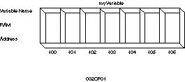
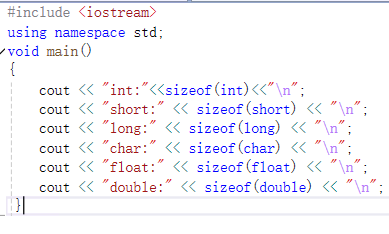

变量

在 C++ 中，变量是存储信息的地方。变量是计算机内存中的一个位置，您可以在其中存储值，并且稍后可以从中检索该值。

计算机的内存可以看作是一系列存储格。每个存储格都是许多排成一排的存储格中的一个。每个存储格（或内存位置）都按顺序编号。这些数字称为内存地址。变量保留一个或多个存储格，您可以在其中存储值。

变量的名称（例如，myVariable）是这些小隔间的标签，这样您就可以轻松找到它，而无需知道其实际内存地址。图 3.1 是此想法的示意图。从图中可以看出， myVariable从内存地址103开始​​。根据myVariable的大小，它可以占用一个或多个内存地址。

**注意：** RAM 是随机存取存储器。运行程序时，程序会从磁盘文件加载到 RAM 中。所有变量也在 RAM 中创建。程序员提到内存时，通常指的是 RAM。

**内存分配**

当你在 C++ 中定义一个变量时，必须告诉编译器这个变量的类型：是整数、字符等。这个信息告诉编译器需要分配多少内存以及你要在变量中存储什么类型的值。

每个存储单元的大小为一字节。如果你创建的变量类型占用两个字节，那么它需要两个字节的内存，或两个存储单元。变量的类型（例如，整数）告诉编译器需要为该变量分配多少内存（多少存储单元）。

#### 整数的大小

在任何一台计算机上，每种变量类型都占用一个固定不变的空间。也就是说，一个整数在一台机器上可能是两个字节，在另一台机器上可能是四个字节，但在两台计算机上，它始终是相同的，日复一日。

char变量（用于保存字符）通常为一个字节长。在大多数计算机上，短整型为两个字节，长整型通常为四个字节，而整型（不带关键字short或long）可以是两个或四个字节。清单 3.1 应该可以帮助您确定计算机上这些类型的确切大小。
**新术语：** 字符是占用一个字节内存的单个字母、数字或符号 _。_


```cpp
#include <iostream>
using namespace std;
void main()
{
	cout << "int:"<<sizeof(int)<<"\n";
	cout << "short:" << sizeof(short) << "\n";
	cout << "long:" << sizeof(long) << "\n";
	cout << "char:" << sizeof(char) << "\n";
	cout << "float:" << sizeof(float) << "\n";
	cout << "double:" << sizeof(double) << "\n";
 }
输出：
int:4
short:2
long:4
char:1
float:4
double:8
```
