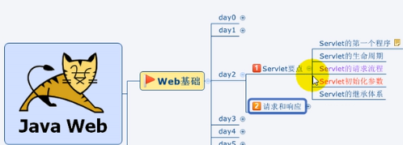
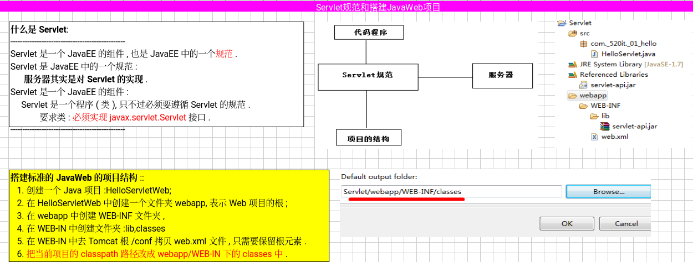
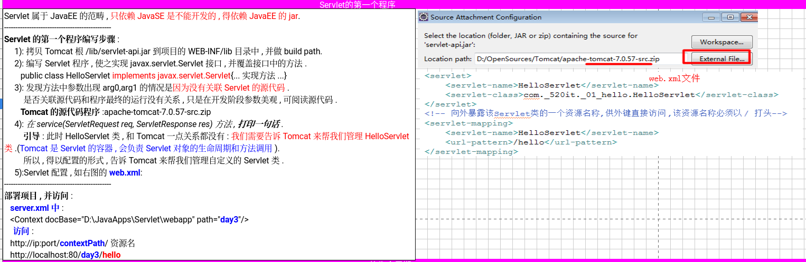
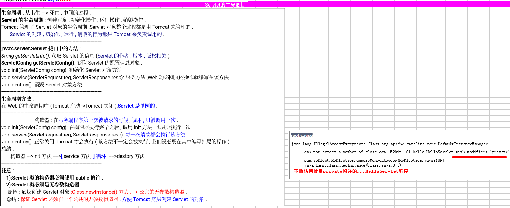
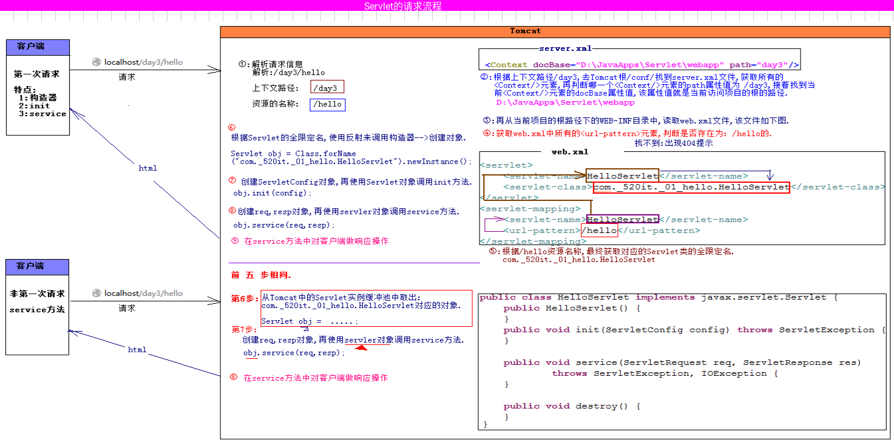
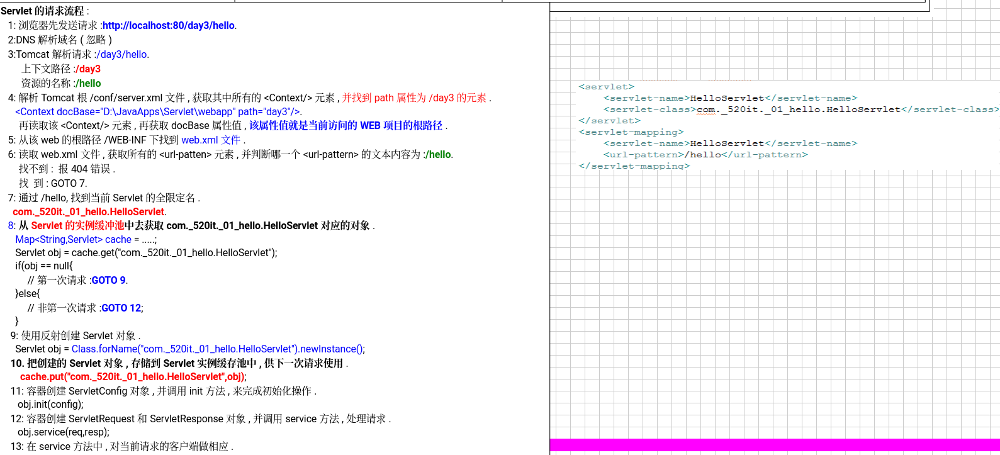
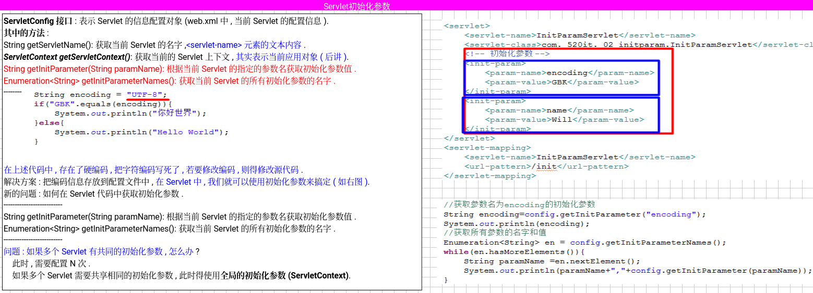
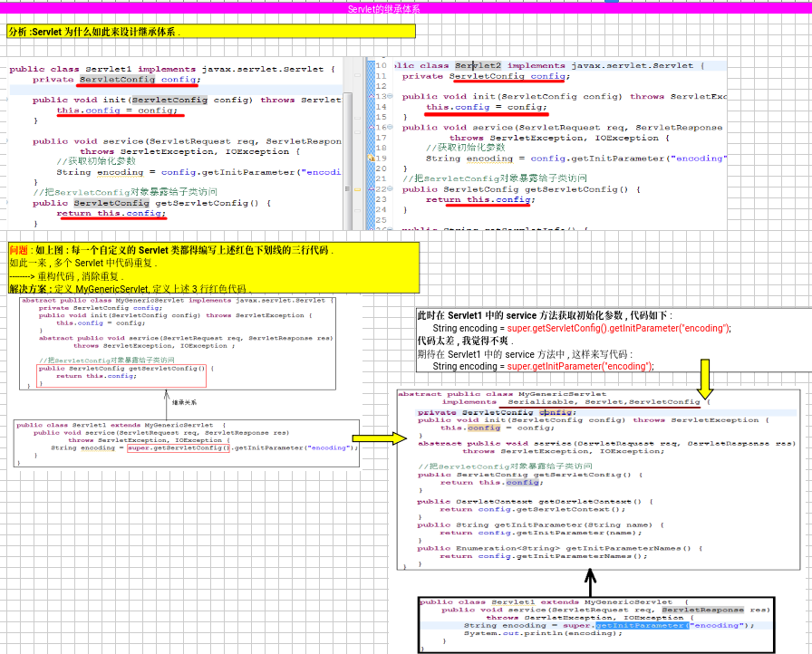

###### servlet规范&搭建javaweb项目
servlet是一个类遵循servlet规范
如图创建java项目webapp目录，并且需要配置输出目录为classes 就是右键项目buildpath 的output选中即可




###### servlet第一个程序

java 项目和tomcat 开始是无任何关系的
如果想要运行，就要用配置告诉tomcat 帮我们管理servlet这个类，需要在项目中web.xml 配置



首先是buldpath后才能加入jar包
我们还需导入源代码，可以不导入不影响
最后我们需要取出这个类的全限定名复制到web.xml的serlvetclass中
起个名字
然后给这个名字搞个servletmapping映射，映射到urlpattern上面

###### servlet的生命周期


```java
package com_wydtt_hello;

import java.io.IOException;
// java11 之后javaee 从甲骨文转到了eclipse基金会 包由javax，改成了jakarta
import jakarta.servlet.Servlet;
import jakarta.servlet.ServletConfig;
import jakarta.servlet.ServletException;
import jakarta.servlet.ServletRequest;
import jakarta.servlet.ServletResponse;

public class HelloServlet implements Servlet{

	public HelloServlet(){
		System.out.println("创建servlet对象");
	}
	@Override
	public void init(ServletConfig config) throws ServletException {
		System.out.println("初始化");
		
	}
	@Override
	public ServletConfig getServletConfig() {

		return null;
	}
	@Override
	public void service(ServletRequest req, ServletResponse res) throws ServletException, IOException {

		System.out.println("服务");
		
	}
	@Override
	public String getServletInfo() {

		return null;
	}
	@Override
	public void destroy() {
		System.out.println("销毁");
	}

}

```

###### servlet的请求流程梳理





###### servletConfig接口获取初始化参数

servlet init的时候需要这个参数
servletConfig 表示当前web.xml的对象
可以在web.xml中配置初始化参数，并在servlet中取出用private 变量 在 service中共享使用处理service程序处理请求业务



```java	private ServletConfig config;
	private ServletConfig config;
	@Override
	public void init(ServletConfig config) throws ServletException {
		// TODO Auto-generated method stub
		this.config=config;
		
	}
	@Override
	public void service(ServletRequest req, ServletResponse res) throws ServletException, IOException {
		String encoding=config.getInitParameter("encoding");
		System.out.println(encoding);
		Enumeration<String> initParameterNames = config.getInitParameterNames();
		while (initParameterNames.hasMoreElements()) {
			String string = (String) initParameterNames.nextElement();
			System.out.println(initParameterNames+","+config.getInitParameter(string));
		}
		if("GBK".equals(encoding)) {
			System.out.println("你好世界");
		}else {
			System.out.println("hello world");
		}
	}
```

###### servlet的继承体系

为什么要这样设计集成体系，更方便的让我用使用
我们可以将程序的配置例如编码方式，存储路径等一些列具有什么特征的抽象出来放到web.xml的初始化参数中。
通过这种方式，提取出公用的方法，不让用户重写，简化用户代码，


此时的代码
```java
package com_wydtt_hello;

import java.io.IOException;
import java.io.Serializable;
import java.util.Enumeration;

import jakarta.servlet.Servlet;
import jakarta.servlet.ServletConfig;
import jakarta.servlet.ServletContext;
import jakarta.servlet.ServletException;
import jakarta.servlet.ServletRequest;
import jakarta.servlet.ServletResponse;

abstract public class mygenericservlet implements Serializable, Servlet,ServletConfig{
private ServletConfig config;
	@Override
	public void init(ServletConfig config) throws ServletException {
		this.config=config;
		
	}
	@Override
	public ServletConfig getServletConfig() {
		
		return this.config;
	}
	@Override
	abstract public void service(ServletRequest req, ServletResponse res) throws ServletException, IOException;
	@Override
	public String getServletInfo() {
		return null;
	}
	@Override
	public void destroy() {
	}
	@Override
	public String getServletName() {
		// TODO 自动生成的方法存根
		return config.getServletName();
	}
	@Override
	public ServletContext getServletContext() {
		// TODO 自动生成的方法存根
		return config.getServletContext();
	}
	@Override
	public String getInitParameter(String name) {
		// TODO 自动生成的方法存根
		return config.getInitParameter(name);
	}
	@Override
	public Enumeration<String> getInitParameterNames() {
		// TODO 自动生成的方法存根
		return config.getInitParameterNames();
	}
}

```

servlet1
```java
package com_wydtt_hello;

import java.io.IOException;

import jakarta.servlet.Servlet;
import jakarta.servlet.ServletConfig;
import jakarta.servlet.ServletException;
import jakarta.servlet.ServletRequest;
import jakarta.servlet.ServletResponse;

public class Servlet1 extends mygenericservlet{

	@Override
	public void init(ServletConfig config) throws ServletException {
		// TODO 自动生成的方法存根
		super.init(config);
		System.out.println("子类的初始化操作");
	}
	@Override
	public void service(ServletRequest req, ServletResponse res) throws ServletException, IOException {
		// TODO 自动生成的方法存根
		String encoding = super.getInitParameter("encoding");
		System.out.println(encoding);
	}
	
}

```
此时的servletgeneric 并没有完善因为 servlet1  中super.init(config); 仍需要用户手写，所以需要继续优化

