###### servlet规范&搭建javaweb项目
servlet是一个类遵循servlet规范
如图创建java项目webapp目录，并且需要配置输出目录为classes 就是右键项目buildpath 的output选中即可


###### servlet第一个程序

java 项目和tomcat 开始是无任何关系的
如果想要运行，就要用配置告诉tomcat 帮我们管理servlet这个类，需要在项目中web.xml 配置


首先是buldpath后才能加入jar包
我们还需导入源代码，可以不导入不影响
最后我们需要取出这个类的全限定名复制到web.xml的serlvetclass中
起个名字
然后给这个名字搞个servletmapping映射，映射到urlpattern上面

###### servlet的生命周期


```java
package com_wydtt_hello;

import java.io.IOException;
// java11 之后javaee 从甲骨文转到了eclipse基金会 包由javax，改成了jakarta
import jakarta.servlet.Servlet;
import jakarta.servlet.ServletConfig;
import jakarta.servlet.ServletException;
import jakarta.servlet.ServletRequest;
import jakarta.servlet.ServletResponse;

public class HelloServlet implements Servlet{

	public HelloServlet(){
		System.out.println("创建servlet对象");
	}
	@Override
	public void init(ServletConfig config) throws ServletException {
		System.out.println("初始化");
		
	}
	@Override
	public ServletConfig getServletConfig() {

		return null;
	}
	@Override
	public void service(ServletRequest req, ServletResponse res) throws ServletException, IOException {

		System.out.println("服务");
		
	}
	@Override
	public String getServletInfo() {

		return null;
	}
	@Override
	public void destroy() {
		System.out.println("销毁");
	}

}

```

###### servlet的请求流程梳理


###### servletConfig接口获取初始化参数

servlet init的时候需要这个参数
servletConfig 表示当前web.xml的对象
可以在web.xml中配置初始化参数，并在servlet中取出用private 变量 在 service中共享使用处理service程序处理请求业务


```java	private ServletConfig config;
	private ServletConfig config;
	@Override
	public void init(ServletConfig config) throws ServletException {
		// TODO Auto-generated method stub
		this.config=config;
		
	}
	@Override
	public void service(ServletRequest req, ServletResponse res) throws ServletException, IOException {
		String encoding=config.getInitParameter("encoding");
		System.out.println(encoding);
		Enumeration<String> initParameterNames = config.getInitParameterNames();
		while (initParameterNames.hasMoreElements()) {
			String string = (String) initParameterNames.nextElement();
			System.out.println(initParameterNames+","+config.getInitParameter(string));
		}
		if("GBK".equals(encoding)) {
			System.out.println("你好世界");
		}else {
			System.out.println("hello world");
		}
	}
```

###### servlet的继承体系

为什么要这样设计集成体系，更方便的让我用使用
我们可以将程序的配置例如编码方式，存储路径等一些列具有什么特征的抽象出来放到web.xml的初始化参数中。
通过这种方式，提取出公用的方法，不让用户重写，简化用户代码，


此时的代码
```java
package com_wydtt_hello;

import java.io.IOException;
import java.io.Serializable;
import java.util.Enumeration;

import jakarta.servlet.Servlet;
import jakarta.servlet.ServletConfig;
import jakarta.servlet.ServletContext;
import jakarta.servlet.ServletException;
import jakarta.servlet.ServletRequest;
import jakarta.servlet.ServletResponse;

abstract public class mygenericservlet implements Serializable, Servlet,ServletConfig{
private ServletConfig config;
	@Override
	public void init(ServletConfig config) throws ServletException {
		this.config=config;
		
	}
	@Override
	public ServletConfig getServletConfig() {
		
		return this.config;
	}
	@Override
	abstract public void service(ServletRequest req, ServletResponse res) throws ServletException, IOException;
	@Override
	public String getServletInfo() {
		return null;
	}
	@Override
	public void destroy() {
	}
	@Override
	public String getServletName() {
		// TODO 自动生成的方法存根
		return config.getServletName();
	}
	@Override
	public ServletContext getServletContext() {
		// TODO 自动生成的方法存根
		return config.getServletContext();
	}
	@Override
	public String getInitParameter(String name) {
		// TODO 自动生成的方法存根
		return config.getInitParameter(name);
	}
	@Override
	public Enumeration<String> getInitParameterNames() {
		// TODO 自动生成的方法存根
		return config.getInitParameterNames();
	}
}

```

servlet1
```java
package com_wydtt_hello;

import java.io.IOException;

import jakarta.servlet.Servlet;
import jakarta.servlet.ServletConfig;
import jakarta.servlet.ServletException;
import jakarta.servlet.ServletRequest;
import jakarta.servlet.ServletResponse;

public class Servlet1 extends mygenericservlet{

	@Override
	public void init(ServletConfig config) throws ServletException {
		// TODO 自动生成的方法存根
		super.init(config);
		System.out.println("子类的初始化操作");
	}
	@Override
	public void service(ServletRequest req, ServletResponse res) throws ServletException, IOException {
		// TODO 自动生成的方法存根
		String encoding = super.getInitParameter("encoding");
		System.out.println(encoding);
	}
	
}

```
此时的servletgeneric 并没有完善因为 servlet1  中super.init(config); 仍需要用户手写，所以需要继续优化

现在主要是将
```java
	@Override
	public void init(ServletConfig config) throws ServletException {
		// TODO 自动生成的方法存根
		super.init(config);
		System.out.println("子类的初始化操作");
	}
```

改成
```java
	@Override
	public void init()  {
		// TODO 自动生成的方法存根
		System.out.println("子类的初始化操作");
	}
```

我们只需要在generic 方法中加入一个空实现并在有参init中加入this.init即可
```java
	@Override
	public void init(ServletConfig config) throws ServletException {
		this.config=config;
		this.init();
	}
	public void init() {
		//空实现
	}
```
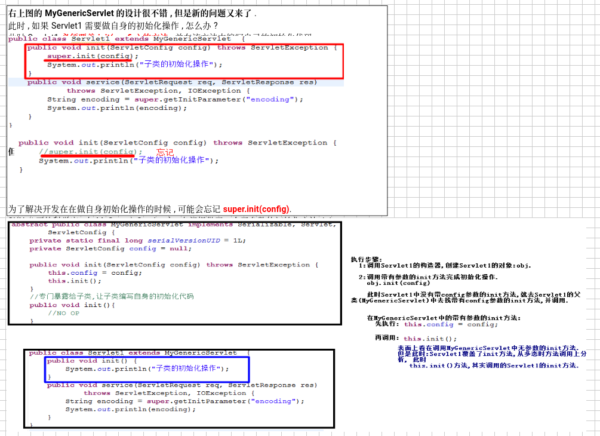

我们手动实现了getnericservlet ，一看和他的源码一样，大师有抄袭我们的嫌疑，哈哈哈，我们离大师又近了一步

手动实现httpsservlet
```java
package com_wydtt_hello;


import java.io.IOException;

import jakarta.servlet.Servlet;
import jakarta.servlet.ServletConfig;
import jakarta.servlet.ServletException;
import jakarta.servlet.ServletRequest;
import jakarta.servlet.ServletResponse;
import jakarta.servlet.http.HttpServletRequest;
import jakarta.servlet.http.HttpServletResponse;

public class Servlet1 extends mygenericservlet{


	public void service(ServletRequest req, ServletResponse resp) throws ServletException, IOException {
		HttpServletRequest request = (HttpServletRequest) req;
		HttpServletResponse response =(HttpServletResponse) resp;
		
		service(request, response);
	}
	//专门处理http 请求
	public void service(HttpServletRequest req, HttpServletResponse resp) throws ServletException, IOException {
		String method = req.getMethod();
		if("GET".equals(method)) {
			doGet(req,resp);
		}else if ("POST".equals(method)) {
			doPost(req,resp);
		}
	}
	private void doPost(HttpServletRequest req, HttpServletResponse resp) {
		// TODO 自动生成的方法存根
		System.out.println("Servlet1.doPost()");
	}
	private void doGet(HttpServletRequest req, HttpServletResponse resp) {
		// TODO 自动生成的方法存根
		System.out.println("Servlet1.doGet()");
	}
}
```

同理需要继续抽取

设计模式体现出模板方法设计模式

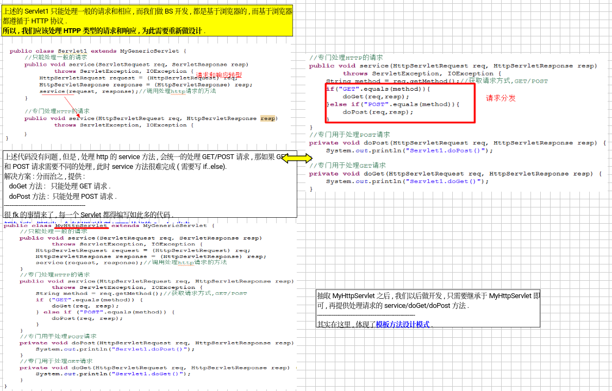
集成体系总结
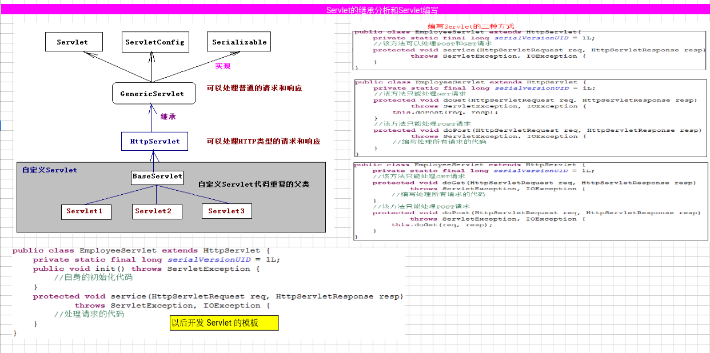

##### 请求和响应
###### HttpServletRequest 接口和常用方法

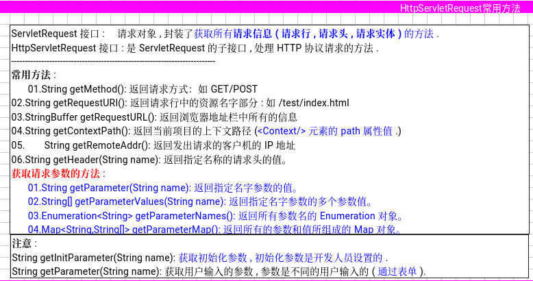

###### 注册案例

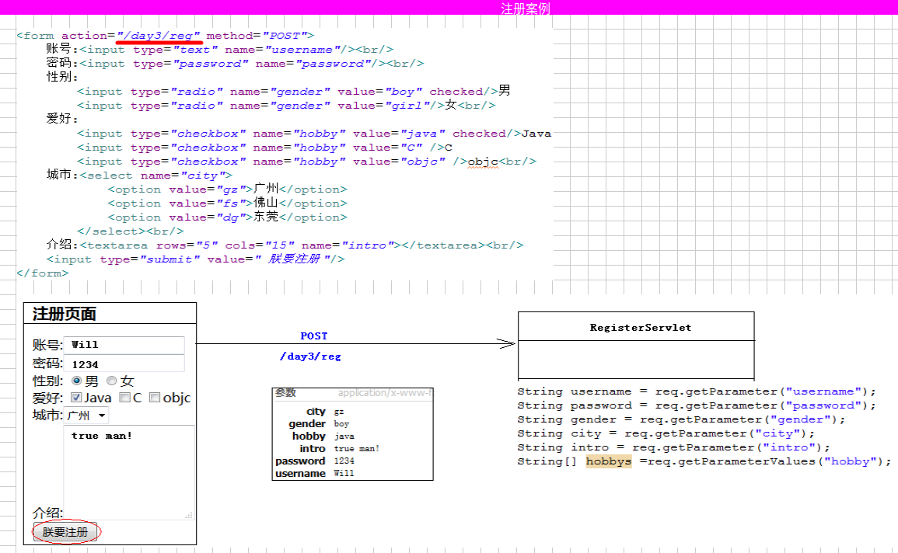
###### 请求中文乱码处理
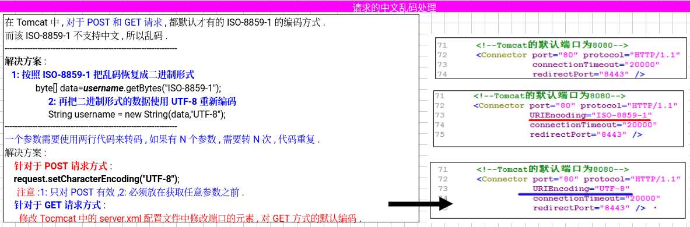

###### HttpServletResponse常用方法

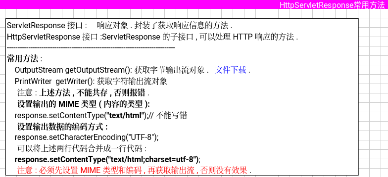
```java
package response;


import jakarta.servlet.ServletException;
import jakarta.servlet.http.HttpServlet;
import jakarta.servlet.http.HttpServletRequest;
import jakarta.servlet.http.HttpServletResponse;

import java.io.IOException;
import java.io.PrintWriter;
import java.io.Serial;
public class HttpServletResponseDemo extends HttpServlet {
    @Serial
    private static final long serialVersionUID = 947081386741548211L;

    @Override
    protected void service(HttpServletRequest req, HttpServletResponse resp) throws ServletException, IOException {
//字节流
//        OutputStream outputStream = resp.getOutputStream();
//        outputStream.write("Spring Brother".getBytes());
//        resp.setContentType("text/html");
//        resp.setCharacterEncoding("UTF-8");
        resp.setContentType("text/html;charset=utf-8");
        PrintWriter writer = resp.getWriter();
        writer.println("Spring Brother");
        writer.println("哈哈哈");//中文乱码
    }
}
```


###### 简单的计算器案例

```java
package cal;

import jakarta.servlet.ServletException;
import jakarta.servlet.http.HttpServlet;
import jakarta.servlet.http.HttpServletRequest;
import jakarta.servlet.http.HttpServletResponse;

import java.io.IOException;
import java.io.PrintWriter;
import java.io.Serial;

public class CalServlet extends HttpServlet {

    @Serial
    private static final long serialVersionUID = 8881989140025691290L;

    @Override
    protected void service(HttpServletRequest req, HttpServletResponse resp) throws ServletException, IOException {
        req.setCharacterEncoding("UTF-8");
        resp.setContentType("text/html;charset=utf-8");
        PrintWriter writer = resp.getWriter();
        //==========接受表单中的数据
        String sNum1=req.getParameter("num1");
        String op=req.getParameter("op");
        String sNum2=req.getParameter("num2");
        String result="";
        if(hasLength(sNum1)&&hasLength(sNum2)){
            Integer num1 = Integer.valueOf(sNum1);
            Integer num2 = Integer.valueOf(sNum2);
            if("+".equals(op)){
                result=num1+num2+"";
            }else if("-".equals(op)){
                result=num1-num2+"";
            }
        }
        //==========计算器界面
        writer.print("<form action='' method='POST'>");
        writer.print("<input type='number' name='num1' value='"+sNum1+"'/>");
        writer.print("<select name='op'>");
        writer.print("<option>+</option>");
        writer.print("<option>-</option>");
        writer.print("<option>*</option>");
        writer.print("<option>/</option>");
        writer.print("</select>");
        writer.print("<input type='number' name='num2' value='"+sNum2+"'/>");
        writer.print("<input type='submit' value=' = '>");
        writer.print("<input type='text' value='"+result+"' disabled>");

    }
    //这个return里面必须熟练
    private boolean hasLength(String str){
        return str!=null&&!"".equals(str.trim());
    }
}

```

总结
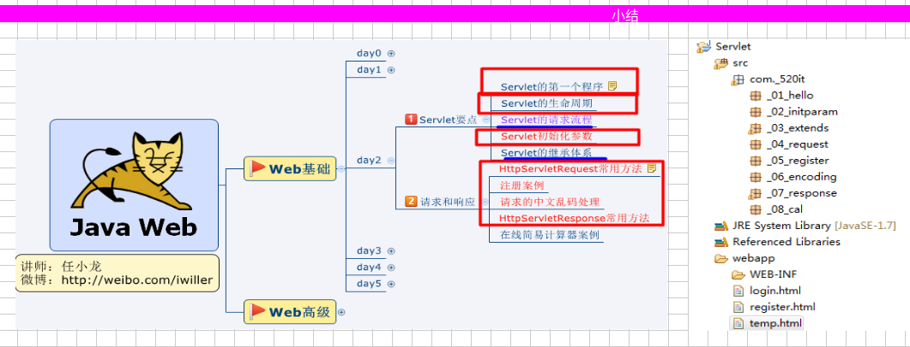

###### servlet 映射细节
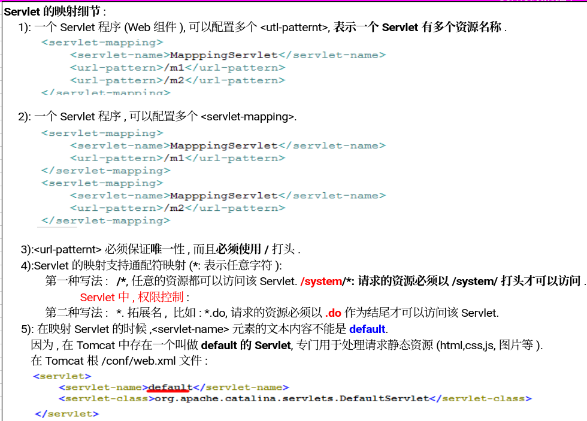

servlet新特性注解配置
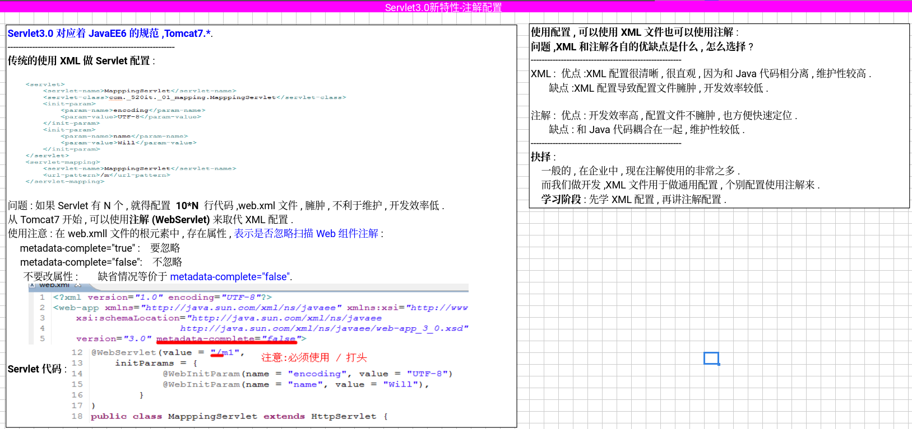

###### tomcat启动的时候先初始化servelt配置
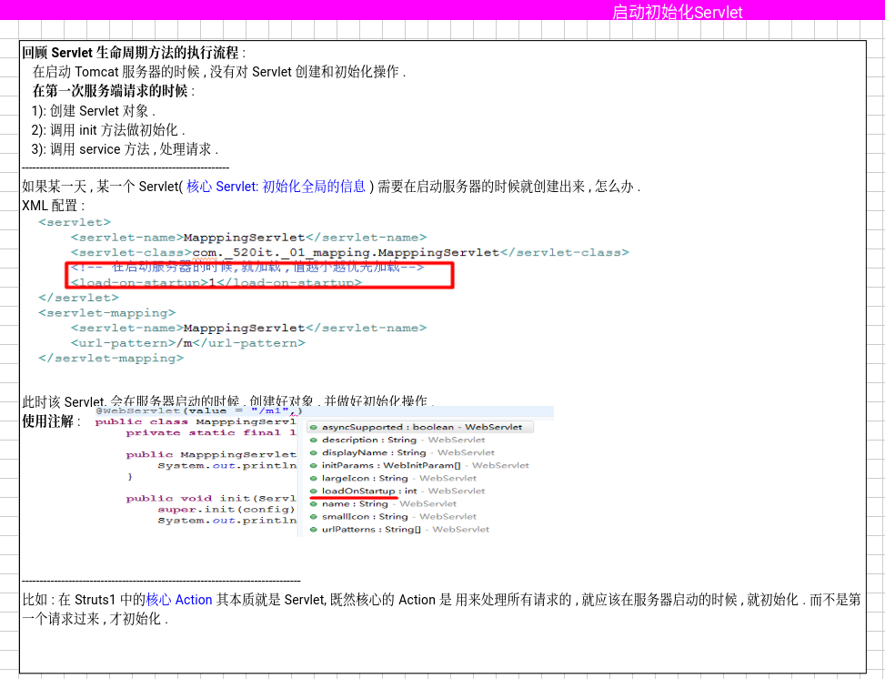

servlet线程不安全问题
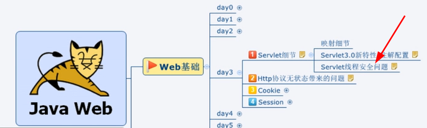

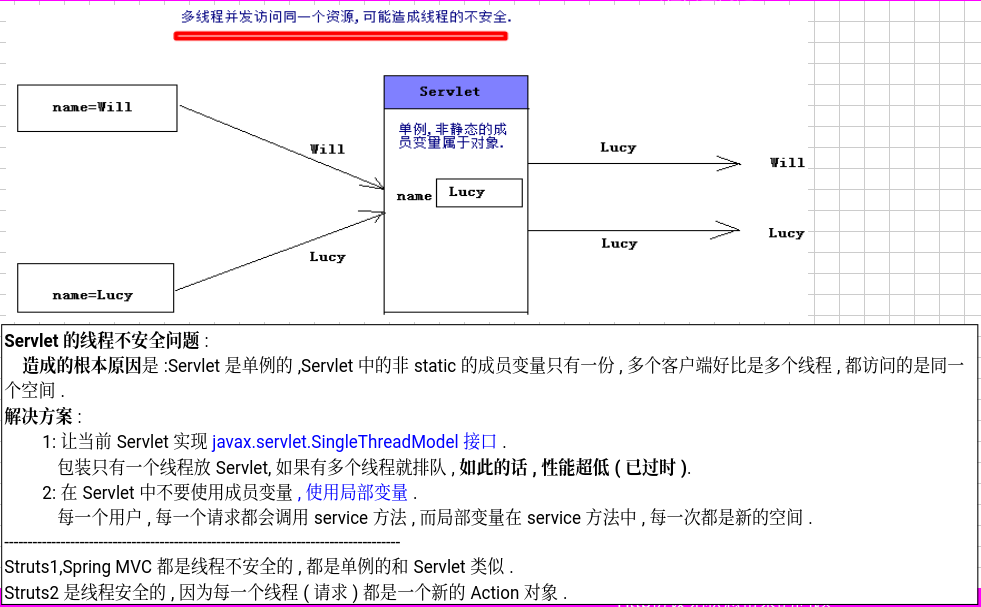
sevlet线程不安全是因为servlet是单例的，在service方法中如果是成员变量而不是局部变量的话，只有一个不变的成员
当多个用户访问时只有一个，造成的结果就是这个值会被最后一个访问的用户覆盖，之前的都没了，但是页游好处就是单例的好处
当将成员变量改成局部变量，就会对每个用户创建一个新的变量，会处理每个用户的service，坏处就是会创建多个变量，有很大风险
strust和springmvc是线程不安全的。strust2是线程安全的