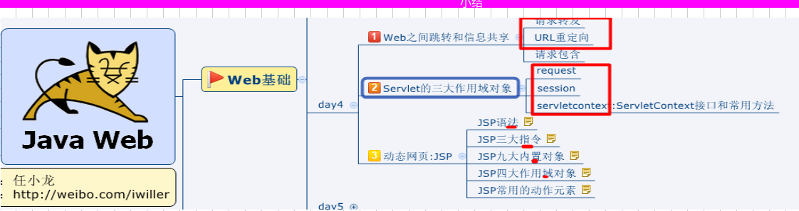
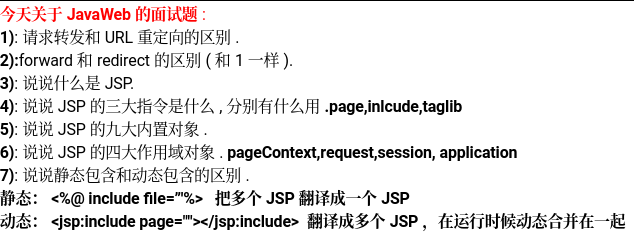
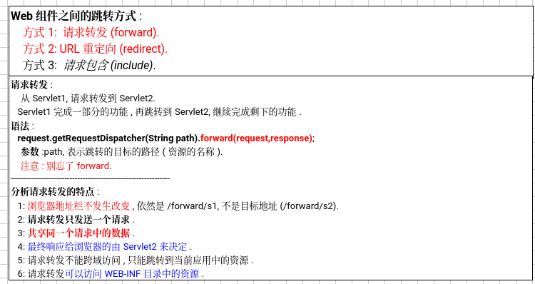
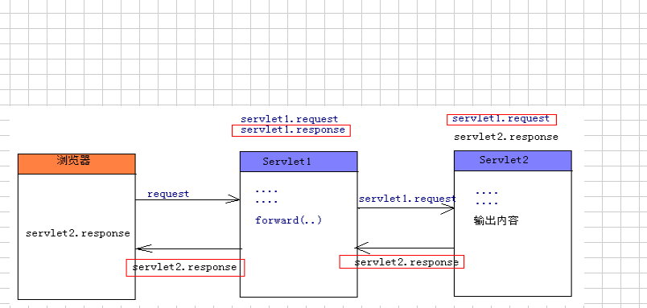
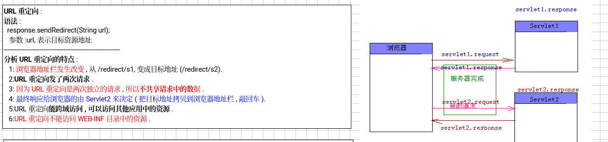
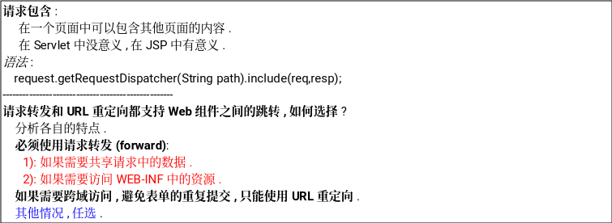
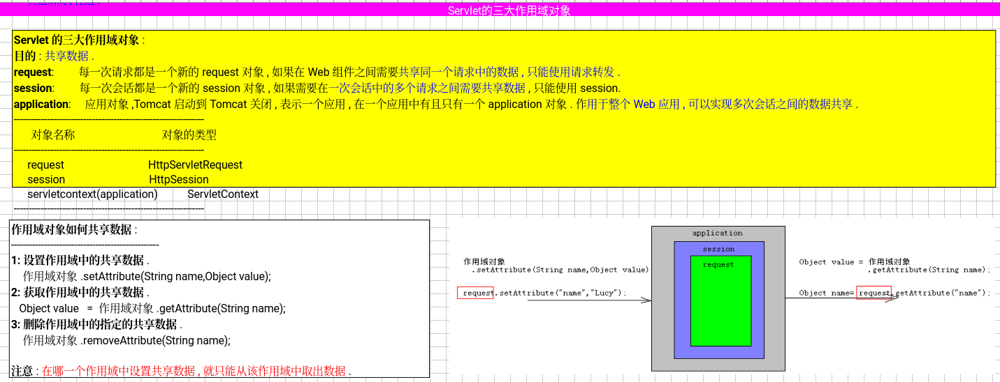

###### 请求转发



需要掌握


---
需要解决怎么传怎么跳的问题


web之间的跳转和信息共享
请求转发



```java
import jakarta.servlet.RequestDispatcher;
import jakarta.servlet.ServletException;
import jakarta.servlet.annotation.WebServlet;
import jakarta.servlet.http.HttpServlet;
import jakarta.servlet.http.HttpServletRequest;
import jakarta.servlet.http.HttpServletResponse;

import java.io.IOException;
import java.io.PrintWriter;

@WebServlet("/forward/f1")
public class Servlet1 extends HttpServlet {

    @Override
    protected void service(HttpServletRequest req, HttpServletResponse resp) throws ServletException, IOException {
        resp.setContentType("text/html;charset=utf-8");
        PrintWriter writer = resp.getWriter();
        System.out.println("servlet1");
        writer.println("servlet1,,,before");
        //请求转发
        req.getRequestDispatcher("/forward/f2").forward(req,resp);
        System.out.println("servlet1,,,after");
        writer.println("servlet1,,,after");
    }
}

```

```java
import jakarta.servlet.ServletException;
import jakarta.servlet.annotation.WebServlet;
import jakarta.servlet.http.HttpServlet;
import jakarta.servlet.http.HttpServletRequest;
import jakarta.servlet.http.HttpServletResponse;

import java.io.IOException;
import java.io.PrintWriter;
@WebServlet("/forward/f2")
public class Servlet2 extends HttpServlet {
    @Override
    protected void service(HttpServletRequest req, HttpServletResponse resp) throws ServletException, IOException {
        resp.setContentType("text/html;charset=utf-8");
        PrintWriter writer = resp.getWriter();

        System.out.println("servlet2");
        writer.println("servlet2,,,");
    }
}
```

学了请求转发，知道了
请求转发的特点
地址栏不变
转发一个请求
多个servlet共享前面的数据
最终响应由最后一个servlet决定
请求转发不能跨域比如不能跨域到baidu.com



---
###### url重定向

url重定向就是改变了浏览器的地址
可以重定向到baidu.com 可以跨域访问



值得注意的是，看右图，他是直接返回给浏览器让浏览器的地址改变的，与请求转发不同的是，请求转发操作的是请求，url重定向是response的返回，旨在改变浏览框的url地址

案例代码
Servlet1
```java
package redirect;

import jakarta.servlet.ServletException;
import jakarta.servlet.annotation.WebServlet;
import jakarta.servlet.http.HttpServlet;
import jakarta.servlet.http.HttpServletRequest;
import jakarta.servlet.http.HttpServletResponse;

import java.io.IOException;
import java.io.PrintWriter;

@WebServlet("/redirect/f1")
public class Servlet1 extends HttpServlet {

    @Override
    protected void service(HttpServletRequest req, HttpServletResponse resp) throws ServletException, IOException {
        resp.setContentType("text/html;charset=utf-8");
        PrintWriter writer = resp.getWriter();
        System.out.println("servlet1,,,before");
        writer.println("servlet1,,,before");
        //url重定向
        resp.sendRedirect("/redirect/f2");
        System.out.println("servlet1,,,after"+req.getParameter("name"));
        writer.println("servlet1,,,after");
    }
}
```

Servlet2
```java
package redirect;

import jakarta.servlet.ServletException;
import jakarta.servlet.annotation.WebServlet;
import jakarta.servlet.http.HttpServlet;
import jakarta.servlet.http.HttpServletRequest;
import jakarta.servlet.http.HttpServletResponse;

import java.io.IOException;
import java.io.PrintWriter;
@WebServlet("/redirect/f2")
public class Servlet2 extends HttpServlet {
    @Override
    protected void service(HttpServletRequest req, HttpServletResponse resp) throws ServletException, IOException {
        resp.setContentType("text/html;charset=utf-8");
        PrintWriter writer = resp.getWriter();

        System.out.println("servlet2"+req.getParameter("name"));
        writer.println("servlet2,,,");
    }
}

```

###### 请求包含



###### Servlet的三大作用域对象



###### servlet的三大作用域对象

```java
首先是ServletRequest，这个对象的作用域是请求范围的，也就是说在一次请求过程中有效。它用来保存请求相关的数据，比如表单参数、HTTP头信息等等。需要注意的是，当请求结束时，这些数据就会被销毁。

然后是HttpSession，它的作用域是会话级别的，也就是在一次用户会话期间都有效。它常用来保存用户登录状态、购物车信息这类需要在多个请求之间保持的数据。不过，会话数据会占用服务器资源，所以使用时要小心管理，避免数据泄露或者内存溢出。

最后是ServletContext，作用域是应用级别的，整个Web应用期间都有效。它适合保存一些对所有用户都共享的数据，比如配置信息、全局计数器等。ServletContext是单例的，所有用户共享同一个实例，所以要注意线程安全的问题。

总结一下，选择哪个作用域对象，主要看数据需要在什么范围内共享。请求内用ServletRequest，会话内用HttpSession，全局用ServletContext。理解了它们的作用域和生命周期，就能更好地管理Web应用中的数据了。
```

### 1. ServletRequest 作用域

**作用域范围**：请求范围（Request Scope）

**生命周期**：从请求开始（如用户提交表单或点击链接）到请求结束（服务器响应完成）。

**用途**：用于存储在单个请求中需要共享的数据。例如，表单数据、查询参数等。

**常用方法**：

- `setAttribute(String name, Object obj)`：设置属性
    
- `getAttribute(String name)`：获取属性
    
- `removeAttribute(String name)`：移除属性
    

**示例**：


```java
// 设置请求属性
request.setAttribute("username", "张三");

// 获取请求属性
String username = (String) request.getAttribute("username");
```


### 2. HttpSession 作用域

**作用域范围**：会话范围（Session Scope）

**生命周期**：从用户会话开始（通常是用户第一次访问应用）到会话结束（如用户注销或会话超时）。

**用途**：用于存储在多个请求之间需要共享的数据。例如，用户登录状态、购物车数据等。

**常用方法**：

- `setAttribute(String name, Object obj)`：设置属性
    
- `getAttribute(String name)`：获取属性
    
- `removeAttribute(String name)`：移除属性
    
- `invalidate()`：invalidate the session
    

**示例**：
```java
// 获取 HttpSession 对象
HttpSession session = request.getSession();

// 设置会话属性
session.setAttribute("user_id", 1001);

```

### 3. ServletContext 作用域

**作用域范围**：应用范围（Application Scope）

**生命周期**：从应用启动到应用关闭。

**用途**：用于存储在整个Web应用中需要共享的数据。例如，配置参数、全局计数器等。

**常用方法**：

- `setAttribute(String name, Object obj)`：设置属性
    
- `getAttribute(String name)`：获取属性
    
- `removeAttribute(String name)`：移除属性
    

**示例**：
```java
// 获取 ServletContext 对象
ServletContext context = getServletContext();

// 设置应用属性
context.setAttribute("app_version", "1.0");

// 获取应用属性
String version = (String) context.getAttribute("app_version");
```

### 总结

- **ServletRequest**：适用于单个请求内的数据共享。
    
- **HttpSession**：适用于多个请求之间需要保持的数据。
    
- **ServletContext**：适用于整个应用范围内需要共享的数据。

