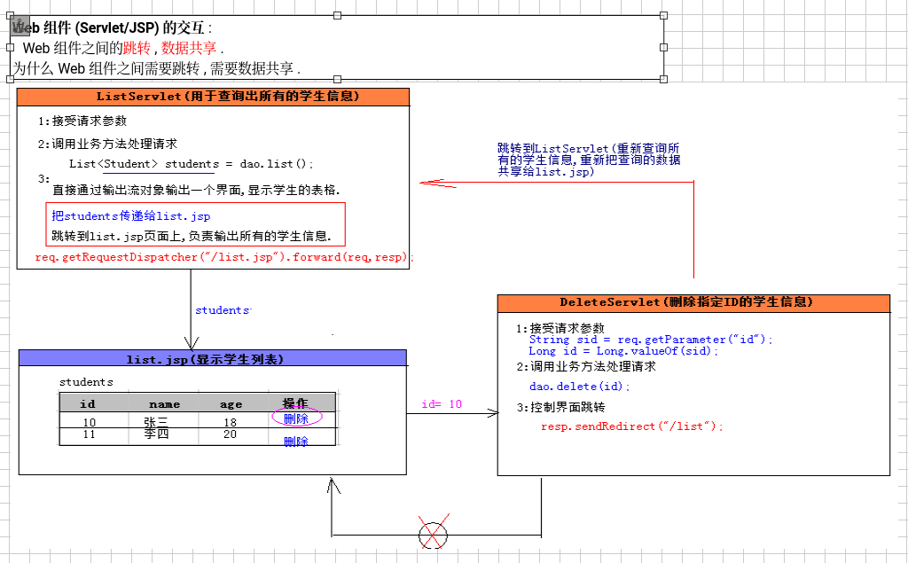

###### 请求转发


需要掌握


---
需要解决怎么传怎么跳的问题



web之间的跳转和信息共享
请求转发


```java
import jakarta.servlet.RequestDispatcher;
import jakarta.servlet.ServletException;
import jakarta.servlet.annotation.WebServlet;
import jakarta.servlet.http.HttpServlet;
import jakarta.servlet.http.HttpServletRequest;
import jakarta.servlet.http.HttpServletResponse;

import java.io.IOException;
import java.io.PrintWriter;

@WebServlet("/forward/f1")
public class Servlet1 extends HttpServlet {

    @Override
    protected void service(HttpServletRequest req, HttpServletResponse resp) throws ServletException, IOException {
        resp.setContentType("text/html;charset=utf-8");
        PrintWriter writer = resp.getWriter();
        System.out.println("servlet1");
        writer.println("servlet1,,,before");
        //请求转发
        req.getRequestDispatcher("/forward/f2").forward(req,resp);
        System.out.println("servlet1,,,after");
        writer.println("servlet1,,,after");
    }
}

```

```java
import jakarta.servlet.ServletException;
import jakarta.servlet.annotation.WebServlet;
import jakarta.servlet.http.HttpServlet;
import jakarta.servlet.http.HttpServletRequest;
import jakarta.servlet.http.HttpServletResponse;

import java.io.IOException;
import java.io.PrintWriter;
@WebServlet("/forward/f2")
public class Servlet2 extends HttpServlet {
    @Override
    protected void service(HttpServletRequest req, HttpServletResponse resp) throws ServletException, IOException {
        resp.setContentType("text/html;charset=utf-8");
        PrintWriter writer = resp.getWriter();

        System.out.println("servlet2");
        writer.println("servlet2,,,");
    }
}
```

学了请求转发，知道了
请求转发的特点
地址栏不变
转发一个请求
多个servlet共享前面的数据
最终响应由最后一个servlet决定
请求转发不能跨域比如不能跨域到baidu.com


---
###### url重定向

url重定向就是改变了浏览器的地址
可以重定向到baidu.com 可以跨域访问


值得注意的是，看右图，他是直接返回给浏览器让浏览器的地址改变的，与请求转发不同的是，请求转发操作的是请求，url重定向是response的返回，旨在改变浏览框的url地址

案例代码
Servlet1
```java
package redirect;

import jakarta.servlet.ServletException;
import jakarta.servlet.annotation.WebServlet;
import jakarta.servlet.http.HttpServlet;
import jakarta.servlet.http.HttpServletRequest;
import jakarta.servlet.http.HttpServletResponse;

import java.io.IOException;
import java.io.PrintWriter;

@WebServlet("/redirect/f1")
public class Servlet1 extends HttpServlet {

    @Override
    protected void service(HttpServletRequest req, HttpServletResponse resp) throws ServletException, IOException {
        resp.setContentType("text/html;charset=utf-8");
        PrintWriter writer = resp.getWriter();
        System.out.println("servlet1,,,before");
        writer.println("servlet1,,,before");
        //url重定向
        resp.sendRedirect("/redirect/f2");
        System.out.println("servlet1,,,after"+req.getParameter("name"));
        writer.println("servlet1,,,after");
    }
}
```

Servlet2
```java
package redirect;

import jakarta.servlet.ServletException;
import jakarta.servlet.annotation.WebServlet;
import jakarta.servlet.http.HttpServlet;
import jakarta.servlet.http.HttpServletRequest;
import jakarta.servlet.http.HttpServletResponse;

import java.io.IOException;
import java.io.PrintWriter;
@WebServlet("/redirect/f2")
public class Servlet2 extends HttpServlet {
    @Override
    protected void service(HttpServletRequest req, HttpServletResponse resp) throws ServletException, IOException {
        resp.setContentType("text/html;charset=utf-8");
        PrintWriter writer = resp.getWriter();

        System.out.println("servlet2"+req.getParameter("name"));
        writer.println("servlet2,,,");
    }
}

```

###### 请求包含


###### Servlet的三大作用域对象


