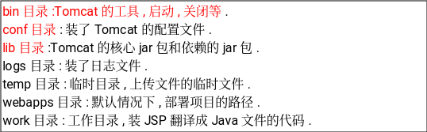
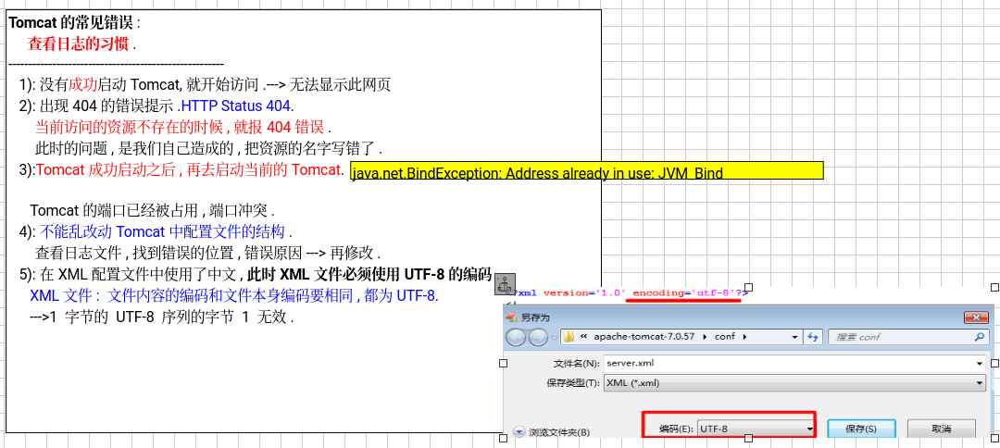
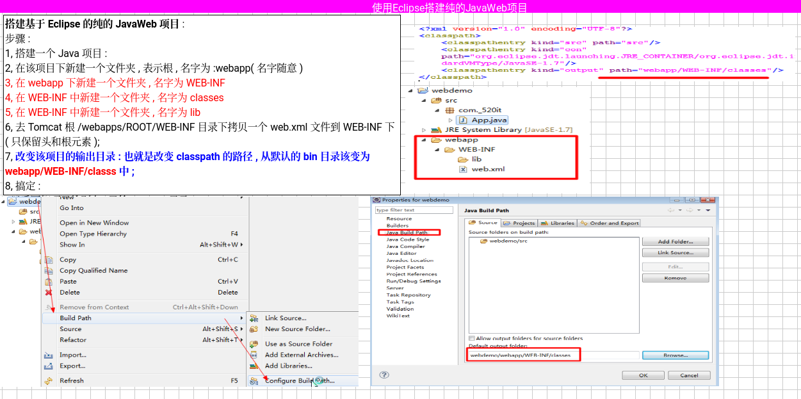
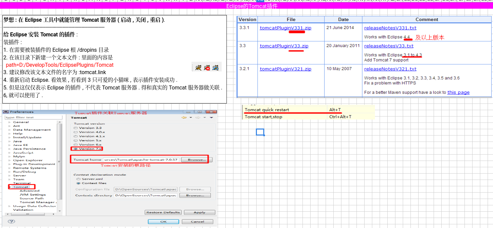
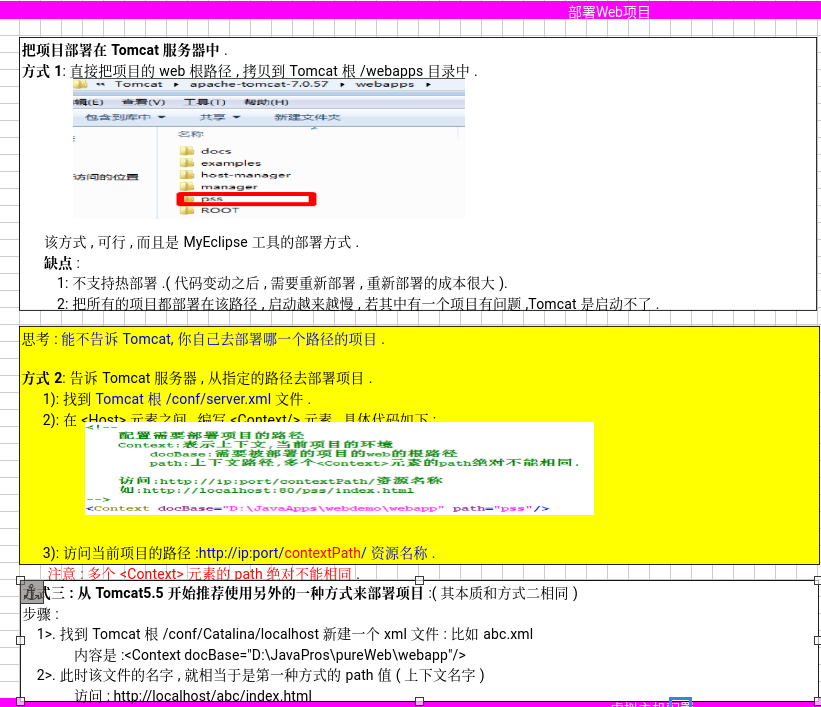
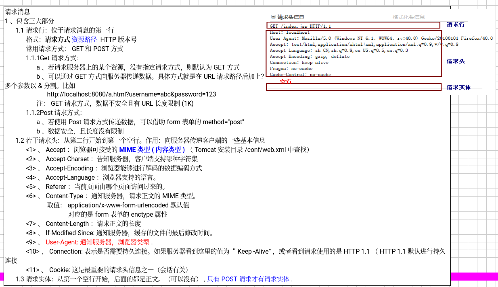
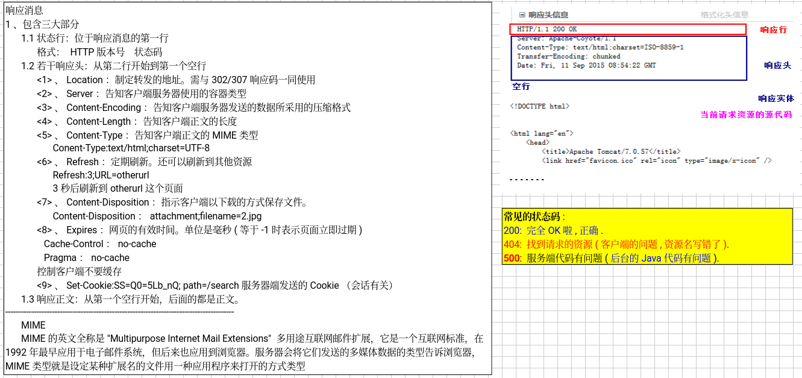
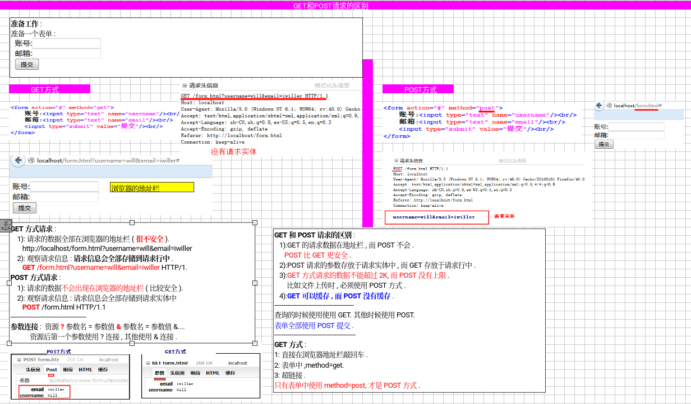

###### tomcat目录结构


###### tomcat常见错误


###### tomcat解压版安装&安全配置


###### javaweb项目结构

根目录代表web项目的根


###### eclipse手动搭建纯javaweb项目



###### eclipse 搜tomcat插件
可以启动，停止，重启tomcat，加上下面配置，用快捷键atl+t重启


###### 部署web项目

告诉tomcat去部署指定路径的项目

在conf/server.xml文件最下面修改Context path

```xml
<Valve className="org.apache.catalina.valves.AccessLogValve" directory="logs"
               prefix="localhost_access_log" suffix=".txt"
               pattern="%h %l %u %t &quot;%r&quot; %s %b" />
		
	<Context docBase="/home/slociv/Documents/learn/Java/webdemo/webapp" path="/pss"/>
      </Host>

```




###### http协议

###### 请求消息
掌握mime 在tomcat安装webxml中查找


###### 响应消息



###### get和post请求的区别
