代码重复性使用
模块化编程

弱类型不需要定义返回值类型，他的类型可以自动换转
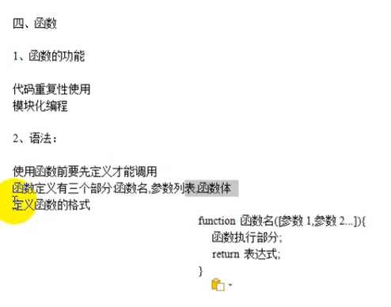
函数的传参
```javascript
<script>
  function display(first,second){
    alert(first + second);
  }
  var i=10;
  var j=20;
  display(i,j);
</script>
```

函数返回值
```javascript
<script>
  function display(first,second){
    return (first + second);
  }
  var i=10;
  var j=20;
  alert(display(i,j));
</script>
```

匿名函数


```javascript
<script>
  function display(first,second){
    return (first + second);
  }
  i=display;
  alert(i(1,2));
</script>
```

```javascript
<script>
  var i=function display(){
    alert("Hello World!");
  }
  i();
</script>
//等价
<script>
  var i=function (){
    alert("Hello World!");
  }
  i();
</script>
```

自调用匿名函数
这个(function(){}) 整体可以看成函数的首地址，找到这个首地址开始执行。
```javascript
<script>
  (function(){})();
</script>
```

```javascript
<script>
  (function(){alert('hello')})();
</script>
```

```javascript
<script>
  (function(first ){alert(first);})();
</script>

undifined
```

```javascript
<script>
  (function(first ){alert(first);})(10);
</script>

输出10
```
向这个自执行匿名函数函数参数输入10给first
 
好处，没名字 ，引用别人的函数不会出现冲突，函数重定义问题。

铺垫
```javascript
<script>
  (function(first ){
    alert(first);
    window.$=100;
    })(10);

    alert($);
</script>
```

外面的$指向函数内部的局部变量，可以直接调用

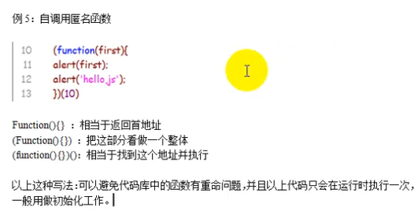
一般用作初始化

###### 全局变量和局部变量
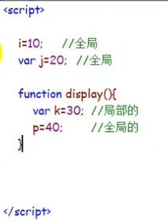
提及

==作用域链和原型链==
全局的输出20
```javascript
<script>
  function display() {
    i=20;
  }
  display();
  alert(i);
</script>
```

局部变量 没反应
```javascript
<script>
  function display() {
    var i=20;
  }
  display();
  alert(i);
</script>
```

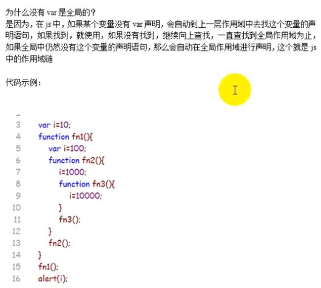

变量屏蔽
```javascript
<script>
  var i=10;
  function fn1() {
  //屏蔽层
    var i=100;//这个定义阻挡了这个局部的变成了10000,但是alert的是全局的i所以是10
    function fn2() {
      i=1000;
      function fn3() {
        i=10000;
      }
      fn3();
    }
    fn2();
  }
  fn1();
  alert(i);
</script>
```
输出10

```javascript
<script>
  var i=10;
  function fn1() {
    i=100;
    function fn2() {
      i=1000;
      function fn3() {
        i=10000;
      }
      fn3();
    }
    fn2();
  }
  fn1();
  alert(i);
</script>
```
输出10000

外部访问内部的变量除了使用返回，还可以使用闭包
外部访问内部闭包内部访问外部作用域链

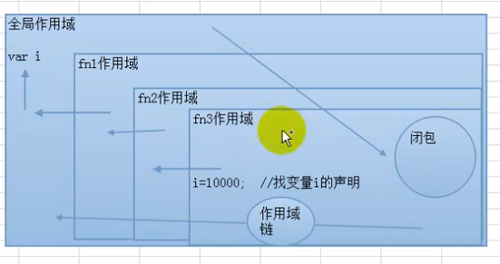


arrgments的使用


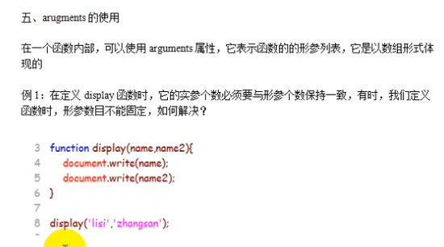


```javascript
<script>
  function display(){
    for(var i=0;i<arguments.length;i++){
      document.write(arguments[i]+'<br>');
    }
  }

  display('lisi','zhangsan','wangwu');
</script>
```

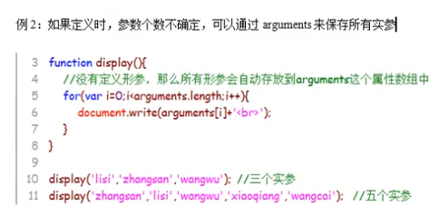


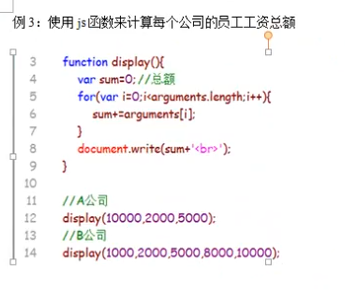

```javascript
<script>
  function display(){
    var sum=0;
    for(var i=0;i<arguments.length;i++){
      sum+=arguments[i];
    }
    document.write(sum+"<br>");
  }

  display(10000,2000,5000);
  display(1000,2000,5000,8000,10000);
</script>
```


###### javascript 词法分析

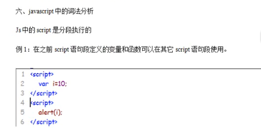

语句段执行顺序


```javascript

<script>
  alert(i);
  var i=10;
</script>
```

未定义，编译的时候已经声明了 var i 但是没有赋值
编译负责声明执行负责赋值


###### js中的错误类型

编译错误
语法错误
 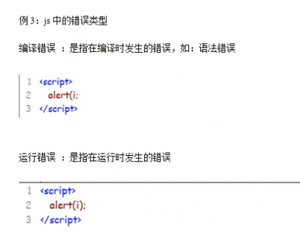
 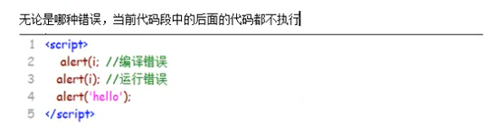

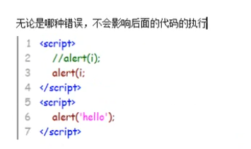

```javascript
<script>
  var first=10;
  alert(i);

</script>
<script>
    alert(first);
</script>
```
输出10

```javascript
<script>
  
  alert(i);//下面的不执行了，但是编译的时候会声明没有赋值，所以执行下面会undifined
  var first=10;

</script>
<script>
    alert(first);
</script>
```

undifined

```javascript
<script>
  
  alert(i);//下面的不执行了，但是编译的时候会声明没有赋值，所以执行下面会undifined
  var first=10;
  function display(){
    alert('hello');
  }
</script>
<script>
    alert(first);
    display();
</script>
```

先undefined再输出hello

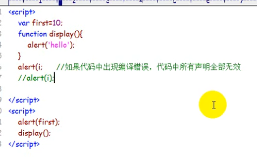
