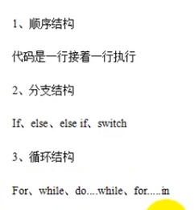

demo01.heml
```javascript
<script language="javascript">
document.write('hello');
</script>
<script language="javascript" src='demo01.js'>
</script>
```

demo01.js
```javascript
document.write('javascript');
```


1基础语法


2.关于script标签


3关于变量


###### 5.数据类型

6种


```javascript
<script language='javascript'>
var name ="张三";
var age='18';
var marry='true';
var height='1.8';
document.write('<ol>');
document.write('<li>'+name+'</li>');
document.write('<li>'+age+'</li>');
document.write('<li>'+marry+'</li>');
document.write('<li>'+height+'</li>');
document.write('</ol>');

function Persion(){}
var p1 = new Persion();
p1.name='lisi';
p1.age=18;
document.write(p1.name+'<br>');
document.write(p1.age+'<br>');
</script>
```

###### 运算符


###### 流程结构
   顺序结构
   div不能写在script的下面因为没有加载dom
   
   

猜数字
```javascript
<script language ='javascript'>
var n = Math.round(Math.random()*500);//0-500
alert(n);

while(true){
  var number = prompt('input 0-500 number');
  if(number>n)alert('too large');
  if(number<n)alert('too small');
  if(number==n){
    alert('ok');
    break;
  }
  
}

</script>
```

